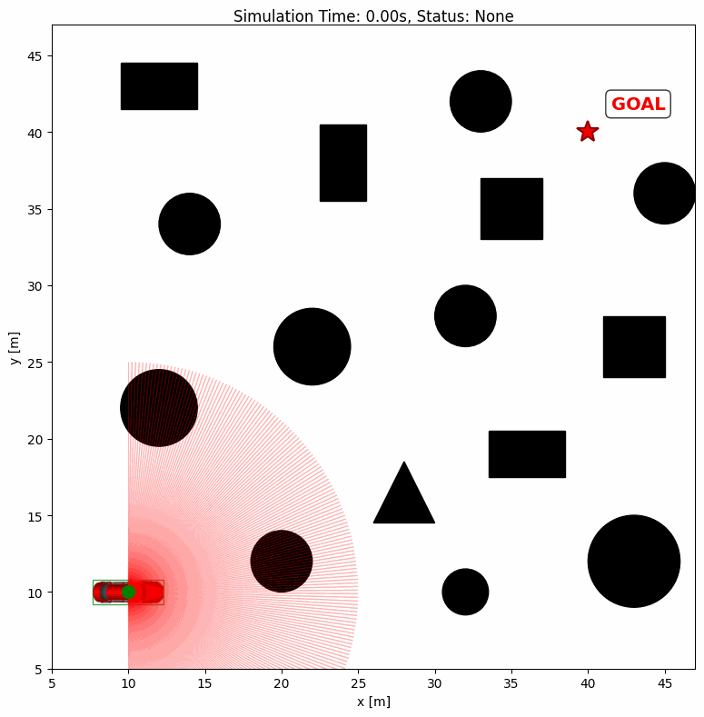
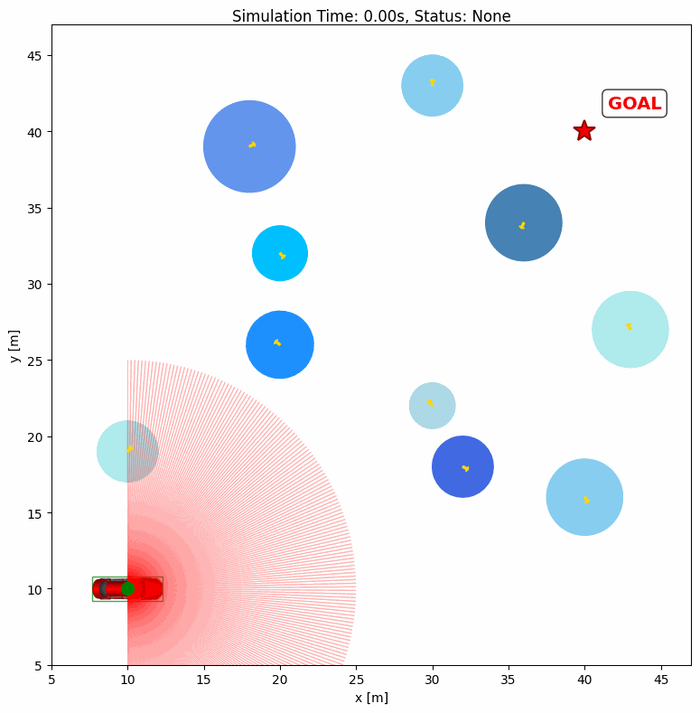

# Time-Efficient Iterative Learning Planning for Safety-Critical Dynamic Obstacle Avoidance

**arXiv:** [arXiv:2609.20435](https://arxiv.org/abs/2609.20435)

This repository provides a lightweight planning framework for safe and efficient mobile-robot navigation in dynamic environments. It improves traversal efficiency through iterative learning and provides lightweight runtime safety correction for dynamic obstacles based on local perception. By avoiding repeated online trajectory optimization, the framework enables real-time navigation with low computational cost.

## Media

| Static obstacle avoidance | Dynamic obstacle avoidance |
| :---: | :---: |
|  |  |

### Real-world experiments

The algorithm has been successfully deployed on an AgileX LIMO Pro robot without hardware-specific tuning.


For more details on the experimental procedure and algorithm, please refer to the supplementary video: [Supplementary Video](https://b23.tv/BV1MDeu6fE36).

## Prerequisites

- Python 3.10 or newer.
- [IR-SIM](https://github.com/hanruihua/ir-sim) 2.8.2.

The installation command below installs the required Python dependencies.

## Installation

After cloning or downloading the repository, open a terminal in its root directory. A separate virtual environment is recommended:

```bash
python -m venv .venv
```

Activate the environment:

```bash
# Linux / macOS
source .venv/bin/activate
```

```powershell
# Windows PowerShell
.venv\Scripts\Activate.ps1
```

Install the package and simulation dependencies:

```bash
python -m pip install -e ".[sim]"
```

## Run the demos

```bash
python example/static_obs/static_obs_ilc_cbf.py
python example/dynamic_obs/dynamic_obs_ilc_cbf.py
```

Run the commands from the repository root. To change the scene, edit the corresponding YAML file in each example directory. Add `--headless` to run without a window.


## License

Project-owned code is released under **LGPL-3.0-or-later**. See [LICENSE](LICENSE).

Embedded third-party components retain their original copyright and license notices.

## Acknowledgments

This project builds on our previous work [VIP](https://github.com/lyushuli/VIP).

The simulations use [IR-SIM](https://github.com/hanruihua/ir-sim).

## Citation

If you find this code or paper is helpful, please kindly star ⭐ this repository and cite our paper by the following BibTeX entry:

```bibtex
@misc{chen2026timeefficientiterativelearningplanning,
  title={Time-Efficient Iterative Learning Planning for Safety-Critical Dynamic Obstacle Avoidance},
  author={Zhiyi Chen and Shuli Lv and Chen Min and Yong Xu and Jian Sun and Quan Quan},
  year={2026},
  eprint={2609.20435},
  archivePrefix={arXiv},
  primaryClass={cs.RO},
  url={https://arxiv.org/abs/2609.20435}
}
```

This research is based on iterative learning planning (ILP). If it is useful in your work, please consider also citing our other papers on ILP:

```bibtex
@ARTICLE{11164953,
  author={Lv, Shuli and Gao, Yan and Quan, Quan},
  journal={IEEE Transactions on Robotics},
  title={High-Efficiency Vector Field by Time-Optimal Spatial Iterative Learning},
  year={2025},
  volume={41},
  number={},
  pages={5624--5644},
  keywords={Path planning;Navigation;Trajectory;Optimization;Computational modeling;Iterative methods;Robot sensing systems;Real-time systems;Iterative learning (IL);model-free;planning;vector field (VF)},
  doi={10.1109/TRO.2025.3610174}
}

@article{lv2026vip,
  title={VIP: Variation-based Iterative-learning Planning for Robotic Navigation},
  author={Lv, Shuli and Mao, Pengda and Min, Chen and Hong, Li and Liu, Runxiao and Wang, Shuai and Quan, Quan},
  journal={arXiv preprint arXiv:2608.24618},
  year={2026}
}


```
